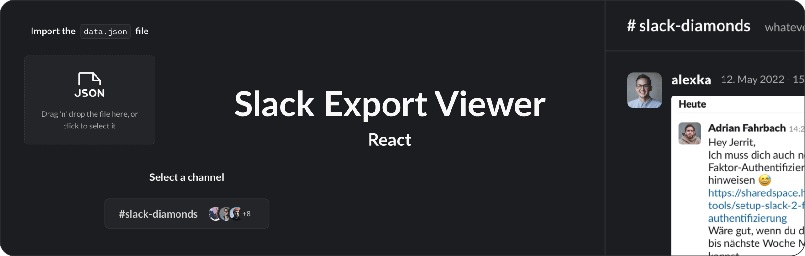

**Slack export viewer written in React** is an application that allows you to view an export of [slackdump](https://github.com/rusq/slackdump) in the browser, mimicking a "Slack like" viewer experience.


## Motivation

The reason for writing this script was the need to have a way to view messages and media files of a [Slack](https://slack.com/) channel after it was bound to be deleted. It was meant to preserve those messages for the future. This is the reason why this application is meant to be built into a single file React app using the [vite-plugin-singlefile](https://www.npmjs.com/package/vite-plugin-singlefile) Vite plugin to allow non tech savvy users to easily start the viewer.

It should also act as a starting place for whoever would like to build something similar as this project in React, providing types and Slack-specific components.


## Usage

### Converting the slackdump export
Before you can view your files, you need to export the Slack data you would like to view using [slackdump](https://github.com/rusq/slackdump).

The format of the export is rather verbose and contains a lot of JSON files and folders. Those JSON files need to be imported in the viewer application. Since the application is running locally using the `file://` protocol, we are not able to import all of these files at once due to browser security restrictions. This repo comes with a script to merge all of those JSON files into one, allowing the end user to select a single `data.json` file using an `<input type="file">` element.

You can find the merge script and instructions on how to use it in the [`./json-merger`](./json-merger) dir.

### Starting the application
```bash
# Install dependencies
npm i
# Run the application locally
npm run dev
```

### Building for production
```bash
# Install dependencies
npm i
# Build the application
npm run build
```

The generated file `dist/index.html` is a bundle of the whole application. Simply open it in the browser to use the app.

> [!IMPORTANT]  
> Make sure to place any media files in the same folder as the exported `index.html` file to view then.

> [!TIP]
> Zip the folder and send it to whoever you would like to be able to view the Slack channel.
